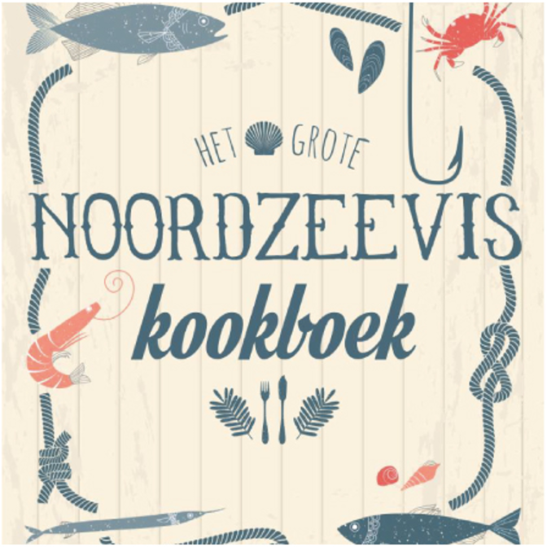
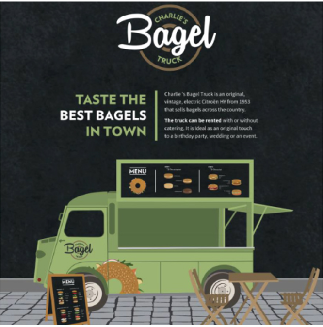

    <h1 class="ahs__title padded-top-xxl xl blue padded-bottom-xl black">Externe Projecten We work for you</h1>
    
Externe projecten zijn werken die we maken voor bedrijven. Als een echte ontwerpstudio kunnen de bedrijven ons contacteren met hun wensen. Wij vullen deze in zodat u bedrijf een zo uniek mogelijk profiel bekomt. Communicatie over alle mogelijke media is onze specialiteit en het is voor ons een must om u visie waar te maken. 

    

        

            
            
        

        

            <h2 class="ahs__title flex column md black">Hoe gaan we te werk</h2>
            
Externe projecten zijn werken die we maken voor bedrijven. Als een echte ontwerpstudio kunnen de bedrijven ons contacteren met hun wensen. Wij vullen deze in zodat u bedrijf een zo uniek mogelijk profiel bekomt. Communicatie over alle mogelijke media is onze specialiteit en het is voor ons een must om u visie waar te maken.

        

    

